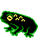

# PuzzleScript Spritesheet Converter

Tool to convert PNG spritesheets into [PuzzleScript](https://www.puzzlescript.net/) object definition text which can be dropped straight into the PuzzleScript editor.

Supports variable sized objects and can be used with both vanilla [PuzzleScript](https://www.puzzlescript.net/) and [PuzzleScript Plus](https://auroriax.github.io/PuzzleScript/editor.html).

Works with PNG spritesheets authored with a transparent background.
Supports loading of other image types, but may not correctly handle non-transparent background colours as no colour-key functionality currently exists.
Please let me know if you would like me to support any extra features.

Play around with it [here](https://bufobufogames.github.io/PSSpritesheetConverter/).

2022 - [BufoBufo](https://bufobufogames.itch.io/)